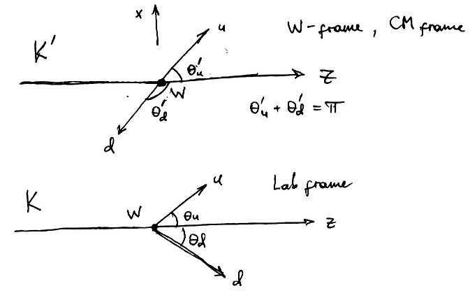

Code to determine polarization fractions in W->qq decay
by fitting a linear combination of expected kinematic distributions 
for individual polariztions (ignoring mixing effects).

Developed for the Wavelets project with Vikram Rentala.

Compilation instructions
------------------------
1. cd lhef
2. make
3. cd ..
4. make
